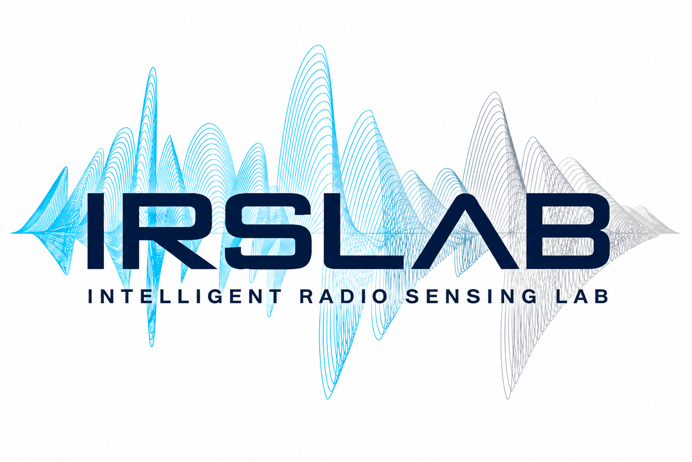

  

  

Our goal is to develop new sensing technologies to see the world from an entirely new perspective, <b>through AI-Driven Wireless+X Sensing.</b>
By integrating the <b>power of AI with Radio-Frequency Signal Processing—and further expanding these capabilities through Sensor Fusion—</b>
we aim to push the boundaries of human perceptual capabilities in diverse areas such as IoT, Health Monitoring, Autonomous Driving, Defense/Remote Sensing, and HCI.

  <a href="https://irslabdgist.github.io/"><b>Lab Homepage ↗</b></a>

---

  
  
## Research Area

- **Wireless-Centric AI** 
    - Radar Signal Processing + AI
    - Wireless Foundation Model
    - Wireless + Generative AI
    - Complex Neural Network

- **Innovative Wireless+X Perception Systems** 
    - Next Sensing Technologies for Various Application Areas (e.g. Health Monitoring, IoT, Defense)
    - Micro-Motion Sensing
    - Remote Sensing with Synthetic Aperture Radar (SAR)
    - Sensing in Challenging Scenarios (e.g. Occlusion, Dark)

- **Multi-Modal & Multi-Sensor Fusion** 
    - Multi-Sensor Fusion
    - Multi-Modal Learning
    - Sensor Signal Processing

 

  Discover our research code and projects in the repositories below.

---

  

<table align="center">
  <tr>
    <td align="center" valign="middle">
      
    </td>
    <td align="center" valign="middle">
      
    </td>
  </tr>
</table>

  <b>Contact</b> · <a href="mailto:jhochoi@dgist.ac.kr">jhochoi@dgist.ac.kr</a>

