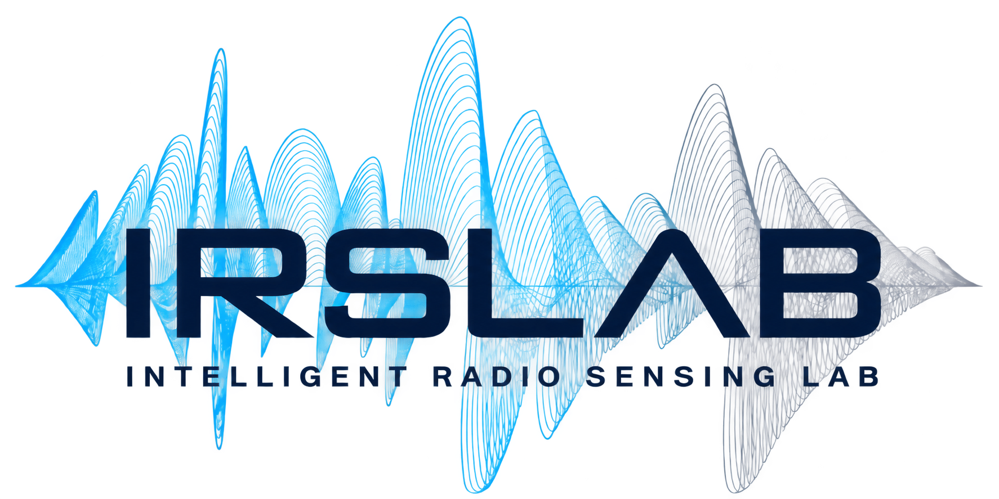

<picture>
  <source media="(prefers-color-scheme: dark)" srcset="assets/lab_logo_dark.png">
  <source media="(prefers-color-scheme: light)" srcset="assets/lab_logo_light.png">
  
</picture>

  

Our goal is to develop new sensing technologies to see the world from an entirely new perspective, <b>through AI-Driven Wireless+X Sensing.</b>
By integrating the <b>power of AI with Radio-Frequency Signal Processing—and further expanding these capabilities through Sensor Fusion—</b>
we aim to push the boundaries of human perceptual capabilities in diverse areas such as IoT, Health Monitoring, Autonomous Driving, Defense/Remote Sensing, and HCI.

  <a href="https://dgist-irslab.github.io/"><b>Lab Homepage ↗</b></a>

---

## Research Area

- **Wireless Foundation Models** 
   - Physics-Aware Self-Supervised Learning
   - Cross-Modal Wireless-Language Pretraining
   - Radar-Grounded Multimodal Scene Reasoning
   - RF Simulation & Digital Twin Synthesis

- **Beyond-Optical Perception Systems** 
   - 3D Human Pose & Motion Estimation
   - Contactless Vital Sign & SpO2 Monitoring
   - See-Through Robotic Manipulation
   - Micro-Doppler Aerial Target Sensing

- **ISAC & AI Signal Processing** 
   - Ambient Wi-Fi & Cellular Network Sensing
   - AI-Driven Virtual I/Q Reconstruction
   - Signal Super-Resolution for Radar Imaging
   - Autonomous Signal Processing Agents

 

  Discover our research code and projects in the repositories below.

---

<table align="center">
  <tr>
    <td align="center" valign="middle">
        
    </td>
    <td align="center" valign="middle">
        
    </td>
  </tr>
</table>

  <b>Contact</b> · <a href="mailto:jhochoi@dgist.ac.kr">jhochoi@dgist.ac.kr</a>

